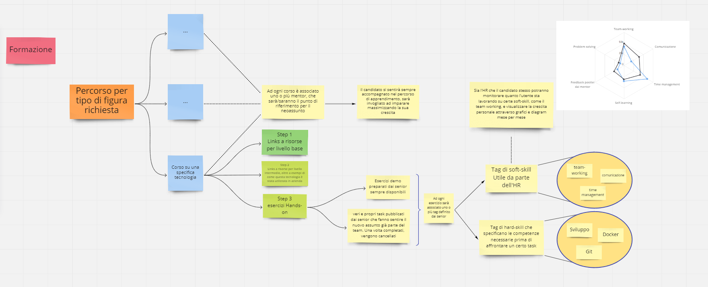

# NowTerna

La nostra App si basa su un processo di onboarding che mira a valorizzare sia Soft Skill che Hard Skill. Ogni nuovo candidato avrà l'occasione di seguire un percorso mirato sulle esigenze sia di Terna che personali, potrà essere seguito da uno o più mentor e i suoi progressi monitorati grazie ad un approccio data driven. Inoltre non mancherà l'occasione di networking con gli altri colleghi sia nei vari corsi di formazione che in un percorso parallelo che abbiamo battezzato *Gilde*, gruppi di persone che collaborano tra di loro sviluppando idee nate proprio dai neoassunti e approvate dai mentor.

[Clicca qui](https://www.figma.com/proto/Yi0JZ56UaTHjlASJji3YDm/Material-Design-2-UI-Kit?node-id=76309%3A1816&scaling=scale-down&page-id=76261%3A1309) per vedere il prototipo della nostra app, oppure scansiona il QR code

----

[Clicca qui](https://miro.com/welcomeonboard/aAbX6NLjTnLWBcVPqsUuHhwTRWtt6f84L5DVme3rPlaSoipOdqliuifgeCsLElNk) per vedere la Miro board con gli aspetti principali della nostra idea, oppure scansiona il QR code

